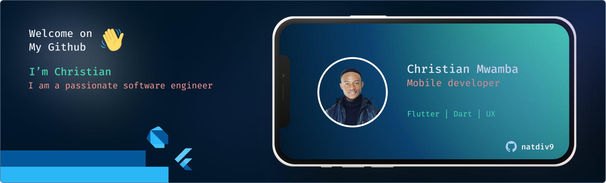
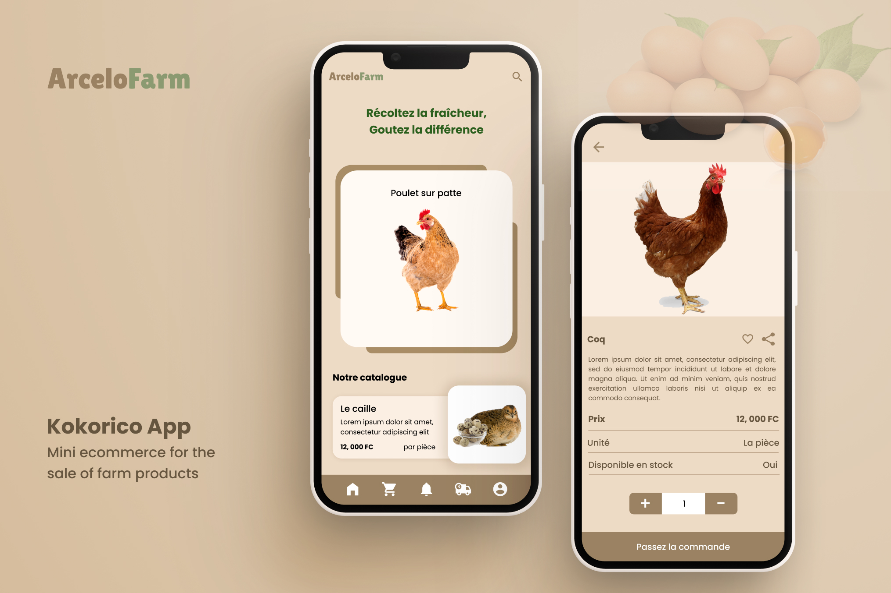

# 

_______________________________________________________

# Christian Mwamba

Hello 👋

Welcome on my Github Page.

I am a software engineer, currently working as a mobile  developer at [Zeghen](https://zeghen.com/). I am passionate about building software that solves real world problems. I am also a big fan of open source and I am always looking for ways to contribute to the community.

## My skills

- Mobile development with Flutter(Android, iOS)
- Web development (JavaScript, Angular, Nodejs, HTML, CSS)
- Backend development (NodeJS, Cloud Functions, PHP, Python)
- Database (MySQL, Firebase Firestore)
- Linux (Debian)

## Achievements

### 1 - [inte-eco](https://inte-eco.web.app)

Software for monitoring information from air pollution level sensors in real time.

Used technologies: Flutter, Firebase, Google Cloud Functions(nodejs), Python

### 2 - [kokorico](https://github.com/natdiv9/kokorico)

Mobile application for the on-line sale of products from a farm.

Used technologies: Flutter, Firebase, Google Cloud Functions(nodejs), Push Notifications

### 3 - [Internews](https://internews.web.app)

Web and mobile application to raise awareness of the electoral process among the Congolese population..

Used technologies: Flutter, API Rest, Leaftlet,

